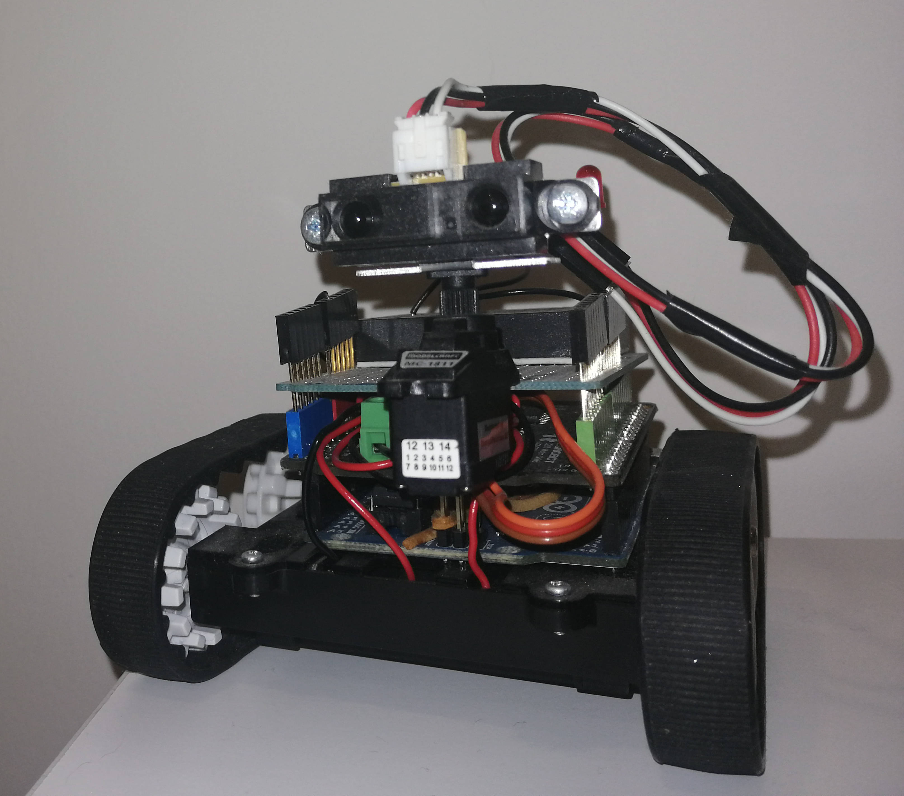

# NEMO <h4>Your Friendly Arduino Robot.</h4>

This Arduino sketch implements an obstacle avoidance robot called NEMO.

## Hardware
- Arduino UNO.
- 1A Motor Shield For Arduino.
- Zumo Chassis Kit.
- 50:1 Micro Metal Gearmotors.
- Breadboard Mini Self-Adhesive Black.
- Sharp GP2Y0A41SK0F Distance Sensor.